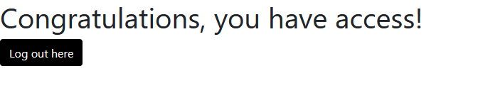

# flask-mongo
This is a skeleton web application integrating the Flask framework with MongoDB unlike using traditional relational databases like SQlite3. This project assumes that you have some basic knowledge in MongoDB (PyMongo collections) and Flask.

## App Overview
The app covers user authentication, registration, password encryption and storage with MongoDB. There are 3 pages in the app: 

<b>Login Page</b>
<p align="center">
  <br>
  
  <br>
  <i>The main login page to enter credentials that will handle the validation and link redirection.</i>
</p>
<br>

<b>Registration Page</b>
<p align="center">
  <br>
  
  <br>
  <i>The registration page to handle creation/storage of user details and password encryption in MongoDB.</i>
</p>
</p>
<br>

<b>Home Page</b>
<p align="center">
  <br>
  
  <br>
  <i>The home page after the user has been authenticated. A logout button is set to log the user out back to the login page.</i>
</p>
</p>
<br>

## How It Works
The main modules to look at is 'models.py' and 'auth/routes.py'. As we are using a noSQL database, we have to build our 'User' object slightly differently from the conventional SQL style.

From [Miguel Grinberg's](https://blog.miguelgrinberg.com/post/the-flask-mega-tutorial-part-v-user-logins) tutorial on using Flask-login:

> The Flask-Login extension works with the application's user model, and expects certain properties and methods to be implemented in it. 
The four required items are listed below:
> - is_authenticated: a property that is True if the user has valid credentials or False otherwise.
> - is_active: a property that is True if the user's account is active or False otherwise.
> - is_anonymous: a property that is False for regular users, and True for a special, anonymous user.
> - get_id(): a method that returns a unique identifier for the user as a string.

### User object
These are defined as static methods in the object. Our database collection name is called "user_details".
```python
class User:
    """User object that can be manipulated with mongo."""

    def __init__(self, username=None, email=None, password=None):
        self.username = username
        self.email = email
        self.password = password
        # Your mongo URI defined in config.py
        self.db = MongoClient(Config.MONGO_URI)["Users"]

    @staticmethod
    def is_authenticated():
        return True

    @staticmethod
    def is_active():
        return True

    @staticmethod
    def is_anonymous():
        return False

    def get_id(self):
        return self.username
```

### User Registration
A step is required to store the details in a dictionary (NoSQL style) before inserting it into the mongo collection (see to_dict()). The password stored in the database is of course, hashed.
```python
  def register(self):
      """Inserting user details into mongo collection."""
      self.db["user_details"].insert_one(self.to_dict())
      print(f"{self.to_dict()} entry created.")

  def to_dict(self):
      """Transform to dict to insert into mongo collection."""
      return {
          "name": self.username,
          "email": self.email,
          # Storing hashed password, you should NEVER store the password itself in the database
          "password": self.password_hash,
      }
```

### Password Encryption
As for password encryption, we will be using the package [Werkzeug](https://werkzeug.palletsprojects.com/en/1.0.x/) with their inbuilt security hashing functions.
```python
@classmethod
def set_password(cls, password):
    """Hashing the password with Werkzeug hash generator."""
    cls.password_hash = generate_password_hash(password)

@staticmethod
def check_password(hashed_password, password):
    """Validating the hashed password."""
    return check_password_hash(hashed_password, password)
```

### Login Authentication - auth/routes.py
This function handles the authentication and redirects user to the home page if the entered credentials are correct. Basically it will look up the details of the user in the database (get_by_username) that is logging in, and then apply a Werkzeug security function (check_password) to check the hashed password in the database matches the user entered password. 
```python
@login.user_loader
def load_user(username):
    user = User().get_by_username(username)
    if not user:
        return None
    return User(username=user["name"])

@bp.route('/login', methods=['GET', 'POST'])
def login():
    """Main login logic."""
    if current_user.is_authenticated:
        return redirect(url_for('index'))

    login_form = LoginForm()
    if login_form.validate_on_submit():
        user = User().get_by_username(username=login_form.username.data)
        if user is not None and User.check_password(hashed_password=user["password"], 
        password=login_form.password.data):
            print("Password validated.")
            print(f"ID: '{user['_id']}' - Username: '{user['name']}' logging in.")
            user_obj = User(username=user["name"])
            login_user(user_obj)
            next_page = request.args.get('next')
            if not next_page or url_parse(next_page).netloc != '':
                next_page = url_for('main.index')
            return redirect(next_page)
        else:
            print(f"User '{login_form.username.data}' entered invalid credentials.")
            flash("Invalid username or password")

    return render_template('login.html', title='Sign In', login_form=login_form)
```
And there you have it, the main logic around authentication and password encryption with Flask and MongoDB.
<br>

## Some Required Files
### config.py
This is the config file that sits at the first level of the project along with the main app module. This config file is not committed as it contains confidential information like secret keys and database credentials. To get an idea, the module should look like this.
```python
import os
from dotenv import load_dotenv

basedir = os.path.abspath(os.path.dirname(__file__))
load_dotenv(os.path.join(basedir, '.env'))

class Config(object):
    SECRET_KEY = os.environ.get("SECRET_KEY") or "some-secret-key"
    MONGO_URI = "some-mongo-credentials"
```

### .flaskenv
Since environment variables aren't remembered across terminal sessions, you may find tedious to always have to set the FLASK_APP environment variable when you open a new terminal window. With a .flaskenv file, Flask allows you to register environment variables that you want to be automatically imported when you run the flask command.

## Resources
The below are links to the resources used to make this project possible.
- [Comprehensive Flask tutorial by Miguel Grinberg](https://blog.miguelgrinberg.com/post/the-flask-mega-tutorial-part-i-hello-world)
- [Stack Overflow discussion on MongoDB use with Flask](https://stackoverflow.com/questions/54992412/flask-login-usermixin-class-with-a-mongodb)
- [Werkzeug documentation](https://werkzeug.palletsprojects.com/en/1.0.x/)
- [Flask PyMongo documentation](https://flask-pymongo.readthedocs.io/en/latest/)


---
### 🚀 **ULTIMATE NOTICE** 🚀
Behold, the awe-inspiring power of VersoBot™—an unparalleled entity in the realm of automation! 🌟
VersoBot™ isn’t just any bot. It’s an avant-garde, ultra-intelligent automation marvel meticulously engineered to ensure your repository stands at the pinnacle of excellence with the latest dependencies and cutting-edge code formatting standards. 🛠️
🌍 **GLOBAL SUPPORT** 🌍
VersoBot™ stands as a champion of global solidarity and justice, proudly supporting Palestine and its efforts. 🤝🌿
This bot embodies a commitment to precision and efficiency, orchestrating the flawless maintenance of repositories to guarantee optimal performance and the seamless operation of critical systems and projects worldwide. 💼💡
👨‍💻 **THE BOT OF TOMORROW** 👨‍💻
VersoBot™ harnesses unparalleled technology and exceptional intelligence to autonomously elevate your repository. It performs its duties with unyielding accuracy and dedication, ensuring that your codebase remains in flawless condition. 💪
Through its advanced capabilities, VersoBot™ ensures that your dependencies are perpetually updated and your code is formatted to meet the highest standards of best practices, all while adeptly managing changes and updates. 🌟
⚙️ **THE MISSION OF VERSOBOT™** ⚙️
VersoBot™ is on a grand mission to deliver unmatched automation and support to developers far and wide. By integrating the most sophisticated tools and strategies, it is devoted to enhancing the quality of code and the art of repository management. 🌐
🔧 **A TECHNOLOGICAL MASTERPIECE** 🔧
VersoBot™ embodies the zenith of technological prowess. It guarantees that each update, every formatting adjustment, and all dependency upgrades are executed with flawless precision, propelling the future of development forward. 🚀
We extend our gratitude for your attention. Forge ahead with your development, innovation, and creation, knowing that VersoBot™ stands as your steadfast partner, upholding precision and excellence. 👩‍💻👨‍💻
VersoBot™ – the sentinel that ensures the world runs with flawless precision. 🌍💥
